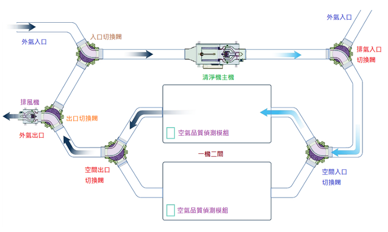

<h1 align="center">WiFi intelligent indoor air quality guardian system</h1>

## Table of contents

- [About the Project](#about-the-project)
- [Air Quality Detection Module](#air-quality-detection-module)
- [Switch valves](#switch-valves)
- [Air purifier](#air-purifier)
- [Ventilator](#ventilator)
- [Mini host](#mini-host)

## About the project

The WiFi intelligent indoor air quality guardian system can perform indoor air circulation purification, sterilization, air renewal, and emergency exhaust.

The system consists of the following main components：

- Air Quality Detection Module
- Switch valves
- Air purifier
- Ventilator
- Mini host

## Air Quality Detection Module

Air Quality Detection Module is mainly responsible for：

- Detect various harmful gases.
- Record data and send data to the Mini host.
- Warns of bad air quality.
- WiFi connection and MQTT communication.

## Switch valves

Switch valves are mainly responsible for：

- Execute the task of switching air ducts in various indoor spaces.
- WiFi connection and MQTT communication.

## Air purifier

Air purifier is mainly responsible for：

- Filter and purify harmful substances in the air.
- WiFi connection and MQTT communication.

## Ventilator

Ventilator is mainly responsible for：

- Accelerate the renewal of indoor air.
- WiFi connection and MQTT communication.

## Mini host

Mini host is mainly responsible for：

- Perform corresponding commands and actions based on the obtained air quality data.
- Store various data.
- WiFi connection and MQTT communication.
